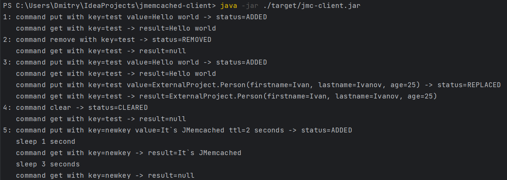

# JMemcached - client

This part of the project is the client library.
It can be added to various projects for storing data.
An example of use the API you can be found in the class: <u>ru.fildv.jmemcachedsomeproject.ExternalProject</u>

Commands used:
* Status **put**(String key, Object object); *add an object by key to the cache*
* Status **put**(String key, Object object, Integer ttl, TimeUnit timeUnit); *add an object by key with lifetime to the cache*
* T **get**(String key); *get an object by key from the cache*
* Status **remove**(String key); *delete an object in the cache by key*
* Status **clear**(); *clear all the cache*

Status options: ADDED, REPLACED, NOT_FOUND, REMOVED, CLEARED

### <u>Run guide:</u>

To build the project: *.\mvnw clean package*

To execute the app (after starting the server): *java -jar ./target/jmc-client.jar*

App view

