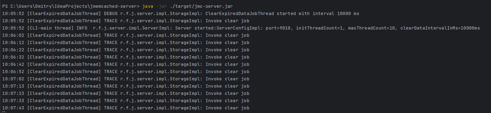

# JMemcached - server

This part of the project is a server. It will work as a service and wait for clients to connect.

### <u>Run guide:</u>

To build the project: *.\mvnw clean package*

To execute the app: *java -jar ./target/jmc-server.jar*

To stop the server enter any of the commands in the terminal: q, quit, exit

File <u>server.properties</u>:\
server.port=9010\
server.thread.count.init=1\
server.thread.count.max=10\
storage.clear.interval.ms=10000

App view

